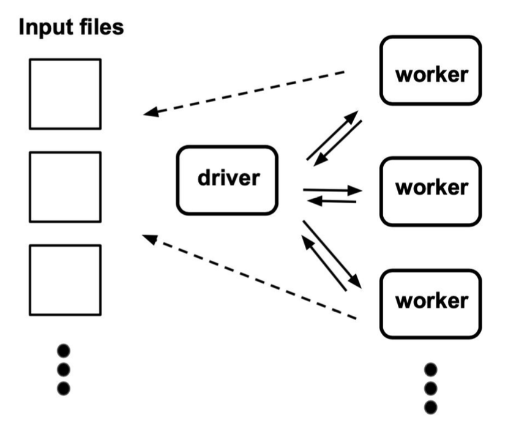
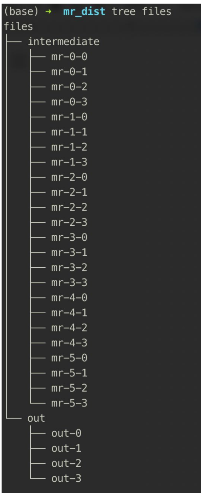

# Coding Test - Map-Reduce

## 0. Administrative
The purpose of the test is not to measure how well you know the specific problem or libraries, but to see how you approach problems that you potentially have not seen before.

All the instructions and information needed are included in the file below.

### IMPORTANT: A clear documentation explaining the general structure of the code and steps on how to setup, build & run the demo is mandatory, otherwise your assignment will NOT be reviewed
### Submission
Please upload your work to a private GitHub repository and give access to the following members who will be checking the assignment. Please also send a confirmation email to connect@causalfoundry.ai with the link.

@dexianta  
@thunderInfy

## 1. Overview

Create a distributed map-reduce program to solve the word count problem on your local machine. 
The server-client communication should use REST API (over HTTP), the problem input is a set of text files, and you want to produce a count indicating how many times each word occurs in the whole dataset. 
You can use any programming language of your choice, use only standard / built-in libraries (refrain using third party http framework). 
On a high level, your code should function as follows:



### Some hints:

- Your word count needs to be distributed: a driver divides the total work among different tasks, and a number of independent workers process these tasks until completion. 
  Once done, you should be able to separately start the driver process and any number of independent worker processes from different terminal windows.
  
- Driver (server) and workers (clients) should only communicate over the network, REST, and this communication should only contain metadata about the tasks. 
  You can assume that both driver and workers have direct access to the file system.
  
- When all workers have finished, they should have produced a set of output files with the word counts of all words appearing in any of the input files 
  (aggregated over the entire set of input files, i.e., one count per word).
  
- You should be able to start workers and drivers in any order; workers should wait for the driver to start, then ask the driver for concrete tasks, one at a time, until all work is done.
  
- The driver decides how to split the total work among tasks and what task to give to each worker. 
  The driver doesn't know how many workers will show up. There are two types of tasks: map tasks and reduce tasks. The number \( N \) of map tasks and \( M \) of reduce tasks should be configurable by the user, either through a command-line option or by some other means.
  
  - Map tasks take the input files, separate text into single words, and put each word into a "bucket" (an intermediate file). 
  The actual bucket to which each word goes should be decided with `(first letter of the word) % M`. Upon completion, the worker should have produced an intermediate file with the name `mr-<map task id>-<bucket id>`. The intermediate files contain one single word per line (i.e., don't do aggregation in the map task).
  
  - Reduce tasks take all `mr-<map task id>-<bucket id>` files with `bucket id = reduce task id`, count the frequency of each word, and output a final file `out-<reduce task id>`, with format similar to:
    ```
    Hello 232
    World 653
    ```

- For simplicity, put map and reduce functions in the worker, and call either one of them depending on the task given to the worker. Don't spend too much time generalizing your code to arbitrary map-reduce tasks; the focus should be on doing word-count in a distributed manner.
  
- The driver should be able to decide when all tasks have finished, and then exit. Workers should also be able to know when the driver had finished and finish themselves as well.
  
- Please include a readme file briefly describing your design. Tests are also valued.

To illustrate, when invoked with ( N = 6 ) and ( M = 4 ), your code should produce a result directory structure as follows:

